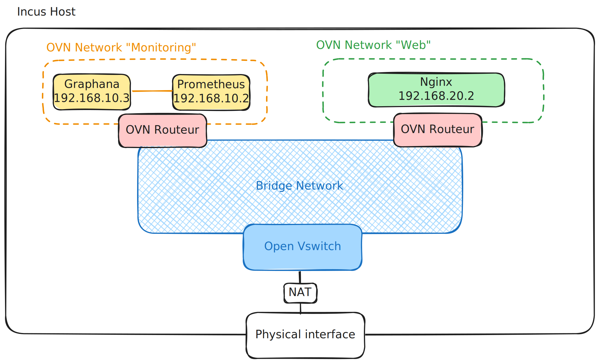
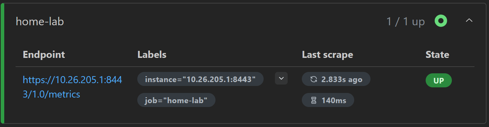
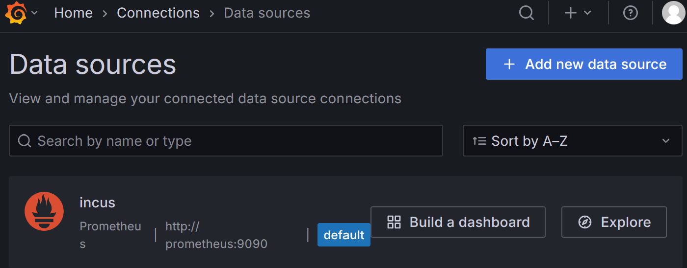

## Introduction

Ce lab n'a pas de but particulier. J'ai simplement entendu parler d'une technologie plutôt sympa et j'ai voulu l'essayer.
Cette technologie, c'est **Incus**. À l'instar de Docker, Incus sert à gérer des conteneurs. Cependant, il dispose de fonctionnalités plus étendues, comme :

  - un contrôle réseau plus complet,
  - la possibilité de faire tourner des conteneurs LXC, OCI ainsi que des machines virtuelles (VM),
  - la gestion des utilisateurs,
  - etc.

Pour plus de détails, je vous invite à consulter la [documentation officielle](https://linuxcontainers.org/incus/docs/main/).

## Prérequis

Une machine virtuelle avec au moins 2 Go de RAM.

## Topologie



Pour expérimenter Incus, j'ai mis en place une topologie composée de :

  - un serveur web,
  - un serveur de collecte de métriques,
  - un serveur de supervision.

> Ici, je ne vais pas m'attarder sur la configuration de Prometheus, Grafana ou Nginx, mais principalement sur celle d'Incus.


### Les types de réseaux

Incus supporte plusieurs types de réseaux. Celui qui nous intéresse ici est le réseau de type **OVN**.
Contrairement à un réseau bridge, un réseau OVN permet :

  - de définir des ACL (listes de contrôle d'accès) entre les instances d'un même sous-réseau (plus précisément, à la même interface réseau),
  - d'avoir une topologie plus contrôlée (notamment en cluster).

> Pour la culture 🧠 : OVN est un système de **SDN (Software-Defined Networking)** qui permet d'avoir une abstraction du réseau virtuel. Il est très pratique si vous souhaitez avoir un certain contrôle sur le réseau, en particulier dans un cluster.

-----

## Configuration

### Installation de Incus

L'installation dépend de votre OS ou gestionnaire de paquets. Suivez la documentation officielle : [Installation d'Incus](https://linuxcontainers.org/incus/docs/main/installing/#installing)

#### Configuration de base

```bash
# Créer un groupe d'administration pour Incus
sudo adduser \$USER incus-admin
sudo newgrp incus-admin
# Initialiser Incus avec la configuration minimale
incus admin init --minimal
```

### Configuration de l'accès à distance

#### Exposer le serveur

```bash
incus config set core.https_address :8443
```

> La commande ci-dessus expose entièrement l’API d’Incus, ce qui signifie qu’elle est accessible depuis toutes les interfaces réseau.
> Je vous recommande donc de spécifier l’adresse IP d’écoute que vous souhaitez utiliser pour le management de votre serveur.
> `incus config set core.https_address <listen address>:8443`

#### Installer le client Incus

Sur une machine distante :

```bash
sudo dnf install incus-client # Fedora
```

#### Créer un token de confiance

Sur le serveur Incus :

```bash
incus config trust add <nom_du_client>
```

Puis sur le client :

```bash
incus remote add <nom_du_client> <adresse_IP_du_serveur>
```

Incus va ensuite vous demander de renseigner le token généré lors de la commande précédente.

-----

## Mise en place de l'infrastructure

### Installation et configuration de OVN

```bash
sudo ovs-vsctl set open_vswitch . \
   external_ids:ovn-remote=unix:/run/ovn/ovnsb_db.sock \
   external_ids:ovn-encap-type=geneve \
   external_ids:ovn-encap-ip=127.0.0.1
```

À exécuter une seule fois, sur l'hôte.

### Création du réseau bridge parent

Les réseaux OVN ont un réseau parent, qui peut être soit un réseau de type bridge, soit un réseau physique.
Dans mon cas, j'ai personnellement créé un réseau bridge dédié.

```bash
incus network create ovn-bridge
```

Ensuite, on configure le réseau `ovn-bridge` :

```bash
incus network set ovn-bridge \
    ipv4.dhcp.ranges=10.142.205.1-10.142.205.100 \
    ipv4.ovn.ranges=10.142.205.101-10.142.205.254 \
    ipv4.routes=192.168.10.0/24,192.168.20.0/24
```

  - `ipv4.dhcp.ranges` : correspond à la plage d'adresses réservée aux machines directement connectées au réseau `ovn-bridge`.
  - `ipv4.ovn.ranges` : correspond à la plage d'adresses réservée aux routeurs OVN qui seront connectés à `ovn-bridge`.
  - `ipv4.routes` : définit les sous-réseaux routés via les routeurs OVN. Dans notre cas, cela correspond aux réseaux monitoring (192.168.10.0/24) et web (192.168.20.0/24).

### Création des réseaux OVN

Maintenant, il suffit de créer des réseaux OVN en s'appuyant sur la configuration du réseau parent. Cela se traduit par les commandes suivantes :

```bash
# Création du réseau pour les instances de monitoring
incus network create monitoring network=ovn-bridge --type=ovn \
    ipv4.address=192.168.10.1/24 ipv4.nat="true" ipv6.address=none
# Création du réseau pour les instances web
incus network create web network=ovn-bridge --type=ovn \
    ipv4.address=192.168.20.1/24 ipv4.nat="true" ipv6.address=none
```

  - `network=ovn-bridge` : indique que le réseau OVN s'appuie sur le bridge `ovn-bridge` comme réseau parent.
  - `--type=ovn` : spécifie qu'il s'agit d'un réseau de type OVN.
  - `ipv4.address` : définit l'adresse IP du routeur OVN et le sous-réseau utilisé.
  - `ipv4.nat="true"` : active la traduction d'adresses (NAT). Sans le NAT, l'accès à Internet n'est pas possible.
  - `ipv6.address=none` : désactive IPv6.

### Déploiement des instances

Pour créer une instance, nous devons spécifier :

- le serveur d’images,
- l’image à utiliser,
- le nom de l’instance,
- le réseau auquel l’instance sera connectée.

>À noter qu’il existe de nombreux autres paramètres que vous pouvez retrouver [ici](https://linuxcontainers.org/incus/docs/main/instances/).


```bash
# Monitoring
incus launch images:debian/12 prometheus --network monitoring
incus launch images:debian/12 grafana --network monitoring
# Web
incus launch images:debian/12 nginx --network web
```

Ci-dessus, je lance des conteneurs basés sur l’image debian/12, issue du serveur d’images officiel d’Incus. J’associe ensuite chacun d’eux à son réseau respectif grâce à l’option `--network`.

Par défaut, les instances reçoivent une adresse IP attribuée automatiquement par le réseau auquel elles sont connectées. Si ces adresses ne vous conviennent pas, il est toujours possible de configurer les interfaces réseau (NICs) des instances manuellement.

```bash
incus config stop <instance>
incus config device set <instance> eth0 ipv4.address=<ip_address>
# exemple
incus config stop nginx
incus config device set nginx eth0 ipv4.address=192.168.20.2
```

### Exposition des services

Dans l'état actuel, nous n'avons pas la possibilité d'accéder aux services depuis le réseau local (LAN). Or, nous avons trois services à exposer :

  - Prometheus sur le port 9090
  - Grafana sur le port 3000
  - Nginx sur le port 80

L'objectif est de rendre ces services accessibles depuis le LAN. Pour cela, nous allons ajouter un **device de type proxy** à chaque instance.

```bash
incus config device add <instance> \
    <nom_du_device> proxy \
    listen=tcp:<adresse_de_l_hôte>:<port_de_l_hôte> \
    connect=tcp:<adresse_du_conteneur>:<port_interne>
```

Configuration pour le Lab.

```bash
# Exposition de Prometheus (port 9090)
incus config device add prometheus \
    proxy proxy \
    listen=tcp:<adresse_de_l_hôte>:9090 \
    connect=tcp:192.168.10.2:9090
# Exposition de Grafana (port 3000)
incus config device add grafana \
    proxy proxy \
    listen=tcp:<adresse_de_l_hôte>:3000 \
    connect=tcp:192.168.10.3:3000
# Exposition de Nginx (port 80 vers 8080 sur l'hôte)
incus config device add nginx \
    proxy proxy \
    listen=tcp:<adresse_de_l_hôte>:8080 \
    connect=tcp:192.168.20.2:80
```

### Configuration d'Incus pour le monitoring

#### Exposer le point de terminaison

Afin que Prometheus puisse récupérer les métriques d'Incus, nous devons, dans un premier temps, exposer le point de terminaison de métriques. Pour cela, il suffit d'exécuter la commande suivante :

```bash
incus config set core.metrics_address "<listen_address>:8443"
```

Ici, l'adresse d'écoute correspond à l'adresse IP du réseau `ovn-bridge`.

> Notez que si vous avez exposé entièrement l'API d'Incus (chose à éviter), vous n'avez pas besoin d'entrer la commande ci-dessus.

#### Création des certificats

Comme pour l’accès à distance, Incus nécessite des certificats afin d’exposer en toute sécurité le point de terminaison des métriques. Nous avons besoin du fichier `server.crt`, qui correspond au certificat public d’Incus. Il se trouve dans le répertoire `/var/lib/incus/`.

Commencez par générer une paire de clés et un certificat auto-signé :

```bash
openssl req -x509 -newkey ec -pkeyopt ec_paramgen_curve:secp384r1 \
    -sha384 -keyout metrics.key -nodes -out metrics.crt -days 3650 \
    -subj "/CN=metrics.local"
```

Ajoutez ensuite le certificat généré dans la liste des sources de confiance pour les métriques :

```bash
incus config trust add-certificate metrics.crt --type=metrics
```

Créez un dossier pour les certificats dans l'instance Prometheus, puis transférez les fichiers nécessaires :

```bash
incus exec prometheus -- mkdir -p /etc/prometheus/tls
incus file push /var/lib/incus/server.crt prometheus/etc/prometheus/tls
incus file push metrics.key prometheus/etc/prometheus/tls
incus file push metrics.crt prometheus/etc/prometheus/tls
```

Enfin, appliquez les bons droits à ces fichiers depuis l'instance :

```bash
# À exécuter dans l’instance Prometheus
chown -R prometheus:prometheus /etc/prometheus/tls
```

### Configuration de Prometheus

Afin d'installer Prometheus, vous devez :

  - le télécharger et l'installer à partir des archives officielles,
  - en faire un service systemd (ou autre selon votre système).

Concernant la procédure d'installation, je vous laisse faire : il existe de nombreux tutoriels disponibles en ligne. Je vais plutôt vous montrer le contenu du fichier `prometheus.yml`.

Pour que Prometheus puisse accéder aux métriques d'Incus, vous devez ajouter les lignes suivantes dans le fichier `prometheus.yml` :

```yaml
- job_name: 'home-lab'
  metrics_path: '/1.0/metrics'
  scheme: 'https'
  static_configs:
    - targets: ['<ip_du_ovn_bridge>:8443']
  tls_config:
    ca_file: '/etc/prometheus/tls/server.crt'
    cert_file: '/etc/prometheus/tls/metrics.crt'
    key_file: '/etc/prometheus/tls/metrics.key'
    server_name: '<nom_du_serveur_incus>'
```

Une fois que vous avez lancé Prometheus, vous pouvez vérifier qu'il parvient à récupérer les métriques en vous rendant à l'adresse suivante : `http://<ip_de_votre_hôte>:9090/targets`




### Configuration de Grafana

Comme pour Prometheus, je vous laisse gérer l'installation de Grafana. Je vais simplement vous montrer comment configurer la source de données.

Pour ajouter la source de données, nous devons spécifier l'adresse de Prometheus ainsi que le port. C'est ici qu'intervient une fonctionnalité très pratique d'Incus. Lorsque deux instances se trouvent dans le même sous-réseau, il n'est pas nécessaire d'utiliser leurs adresses IP pour qu'elles puissent communiquer entre elles. Nous pouvons simplement utiliser le nom des instances. Cela est dû au fait qu'Incus met en place un `dnsmasq` local.

Ainsi, lors de la création de la source de données dans Grafana, il est possible d'indiquer le nom de l'instance Incus au lieu de son adresse IP, de la manière suivante : `http://prometheus:9090`



Maintenant que la source de données a été mise en place, nous pouvons créer un nouveau tableau de bord afin d'exploiter les métriques.

Vous pouvez obtenir un aperçu des métriques disponibles dans Incus à l'aide de la commande suivante :

```bash
incus query /1.0/metrics
```

### Configuration des ACLs

Comme je l'ai mentionné au début, les réseaux OVN permettent de mettre en place des ACLs (listes de contrôle d'accès) entre deux instances connectées au même réseau. Après l'ajout d'ACLs, Incus applique automatiquement une règle implicite qui bloque tout le trafic ne correspondant pas explicitement à une règle autorisée.

C'est ce que nous allons faire ici, en autorisant uniquement :

  - le serveur Grafana à effectuer des requêtes TCP sur le port 9090 du serveur Prometheus,
  - et le serveur Prometheus à faire des requêtes HTTP vers l'IP du réseau `ovn-bridge`, afin de récupérer les métriques d'Incus.

Dans un premier temps, on crée une ACL nommée `monitoring` :

```bash
incus network acl create monitoring
```

Ensuite, on ajoute deux règles à cette ACL :

1.  Autoriser le trafic TCP en provenance de Grafana (192.168.10.3) vers Prometheus (192.168.10.2) sur le port 9090 :

<!-- end list -->

```bash
incus network acl rule add monitoring ingress \
    protocol=tcp \
    source=192.168.10.3 \
    destination=192.168.10.2 destination_port=9090 \
    state=enabled action=allow
```

2.  Autoriser le trafic TCP en provenance de Prometheus (192.168.10.2) vers l'IP du réseau `ovn-bridge` (ici 10.26.205.1) sur le port 8443 :

<!-- end list -->

```bash
incus network acl rule add monitoring egress \
    protocol=tcp \
    source=192.168.10.2 \
    destination=10.26.205.1 destination_port=8443 \
    state=enabled action=allow
```

Enfin, on applique cette ACL au réseau `monitoring` :

```bash
incus network set monitoring security.acls=monitoring
```

Le conteneur Grafana ne peut plus envoyer de requêtes ICMP (ping) vers Prometheus, mais il peut toujours établir une connexion HTTP sur le port 9090.

De même, Prometheus ne peut plus envoyer de pings vers l'IP du bridge OVN, mais il peut toujours récupérer les métriques via HTTPS sur le port 8443.

-----

## Conclusion

Dans ce petit lab, nous avons vu les bases d'Incus, à savoir :

  - la création de conteneurs,
  - la création de réseaux OVN,
  - la création d'ACL.

Ce n'est qu'une brève introduction. Incus couvre également d'autres concepts comme les projets, les snapshots ou encore les profils (plus ou moins équivalents aux templates dans Proxmox). Sans oublier qu’Incus s’intègre plutôt bien avec des outils comme Terraform ou Ansible.

J'espère que cela vous a plu 😊

-----

# Sources

  - [Incus Doc](https://linuxcontainers.org/incus/docs/main/)
  - [LXD Doc](https://documentation.ubuntu.com/microcloud/v2-edge/lxd/)