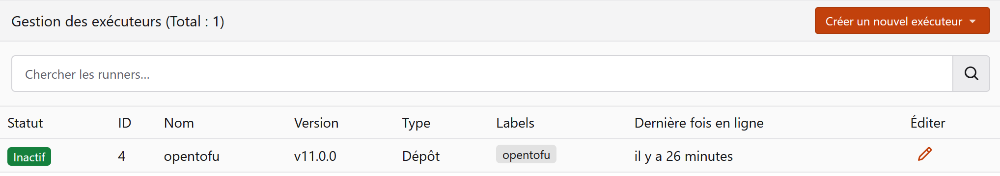
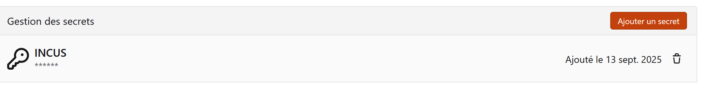
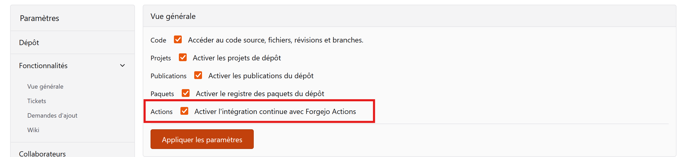
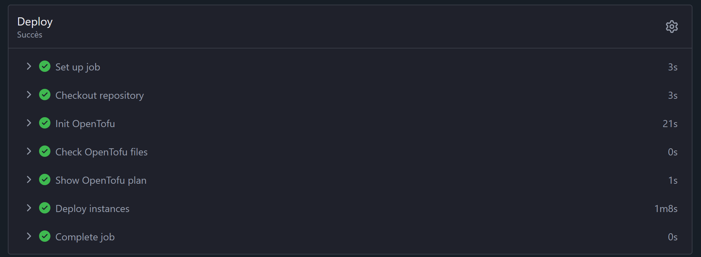

## **Introduction**

### Objectif

Bonjour à tous 😁.

Aujourd'hui, l'objectif est de tester Forgejo en automatisant le déploiement de code OpenTofu que j'ai réalisé dans l'article [Introduction à l'IaC](https://bluecaelo.github.io/posts/opentofu/) en créant un **workflow**.

### Prérequis

  - Un serveur Incus fonctionnel.

-----

## **Forgejo**

### Présentation

Offrir une alternative **open source** à GitHub tout en proposant un environnement similaire, c'est le leitmotiv de Forgejo.

Il se démarque par sa **simplicité de maintenance**. Si des modifications sont nécessaires, il suffit de changer les paramètres du fichier `app.ini`. De plus, il est très léger et principalement écrit en **Go**.

**Pourquoi choisir Forgejo ?**

Si vous hésitez, posez-vous les questions suivantes :

  - Je souhaite une solution **open source** qui le reste ?
  - Je souhaite une solution **easy to maintain** ?
  - Je souhaite une solution qui **écoute sa communauté** ?
  - Je veux faire du **CI/CD** ?

Si vous avez répondu "oui" à ces questions, alors Forgejo est la solution.

### L'architecture de Forgejo

Forgejo est composé de deux éléments principaux :

  - **The Forgejo server :** Il est en charge de stocker nos **Git repositories** et constitue le cerveau derrière nos automatisations.
  - **The runners :** Leur rôle principal est d'exécuter les tâches de **build**, de **test** ou de **deployment** qui leur sont assignées par le serveur Forgejo.

### Forgejo Actions

Forgejo Actions est une plateforme de **CI/CD**. Elle permet d'automatiser des tâches telles que le **build**, les **unit tests** ou le **deployment** en **production**. Son architecture repose sur plusieurs éléments :

  - **Workflows** : Les workflows sont une succession de **jobs** (tâches) définis dans un fichier `.yml`. Ils sont déclenchés suite à un **event** dans le **repository** ou manuellement si nécessaire.
  - **Jobs** : Les jobs sont un ensemble d'étapes (**steps**) qui s'exécutent sur le même **executor**. Les **steps** s'exécutent dans l'ordre indiqué dans le fichier `.yml`.
  - **Events** : Les **events** sont des activités du **repository** qui déclenchent les **workflows**. Il peut s'agir, par exemple, d'une **pull request** ou d'un **merge**. Pour consulter la liste des **events** disponibles, cliquez [ici](https://forgejo.org/docs/latest/user/actions/reference/#jobsjob_idif).

-----

## **Installation et Configuration**

### Création d'une instance Forgejo

```
incus launch images:debian/12 forgejo
```

Dans l'instance, il faut installer les paquets suivants :

  - openssh-server
  - gpg
  - wget

<!-- end list -->

```
incus exec forgejo -- apt install openssh-server gpg wget
```

### Installation de Forgejo

L'installation de Forgejo est très bien guidée. Vous pouvez suivre la [documentation officielle](https://forgejo.org/docs/latest/admin/installation/binary/) sans crainte.

Pour ma part, je vais le déployer avec une **database SQLite** directement intégrée. Sachez que Forgejo supporte également d'autres **databases**, comme :

  - MySQL
  - PostgreSQL
  - MariaDB

Vous trouverez les instructions pour la préparation de ces **databases** [ici](https://forgejo.org/docs/latest/admin/installation/database-preparation/).

Les opérations ci-dessus sont à réaliser dans l'instance Forgejo. Pour accéder au **shell** de l'instance, nous devons utiliser la commande suivante :

```
incus shell forgejo
```

### Exposer Forgejo avec Incus

Pour exposer Forgejo, j'ai ajouté des **devices** de type `proxy` qui vont transférer les requêtes du port de mon hôte vers Forgejo.

Pour la redirection HTTP :

```
incus config device add forgejo http-proxy proxy listen=tcp:<Ip de l'hôte Incus>:3000 connect=tcp:<Ip de l'instance forgejo>:3000
```

Pour la redirection SSH :

```
incus config device add forgejo ssh-proxy proxy listen=tcp:<Ip de l'hôte Incus>:222 connect=tcp:<Ip de l'instance forgejo>:22
```

### Première connexion

Une fois que toutes les étapes d'installation sont terminées, vous pouvez vous rendre à l'URL suivante : `http://<ip de votre hôte>:3000`.

Lors de votre première connexion, Forgejo vous demandera de spécifier des paramètres tels que le port SSH ou le port HTTP.

> Vous pouvez modifier à tout moment les paramètres de Forgejo dans le fichier `/etc/forgejo/app.ini`.

L'option `Disable self-registration` vous permet de restreindre la création de compte à l'administrateur. Cette option n'est valide que si vous créez un administrateur. La création de ce dernier peut se faire dans la section `adminstrator account settings` de la page.

### Configuration SSH

Pour ajouter une **SSH key** à Forgejo, il vous suffit de cliquer sur votre profil, puis d'aller dans **Settings** \> **SSH/GPG Keys** \> **Manage SSH Keys**.

Pour la configuration de **SSH**, je vous recommande de lire la [page suivante](https://docs.codeberg.org/security/ssh-key/), qui saura vous expliquer bien mieux que moi comment utiliser les **SSH keys**.

-----

## **Mise en place du workflow**

### Création du dépôt

La première étape est la création du **repository** dans lequel nous allons stocker nos fichiers :

  - main.tf
  - varaibles.tf
  - provider.tf

>OpenTofu stocke ses états dans un fichier `terraform.tfstate`. Pour éviter que ce fichier soit enregistré sur notre **repository**, il est nécessaire de créer un `.gitignore`.

Pour ce faire, il nous faut cocher l'option `Initialiser le dépôt` et choisir le fichier `.gitignore` prédéfini pour Terraform.


### Les Runners

#### Création de l'instance OpenTofu

Je vais ici créer une instance qui sera en charge d'exécuter mon code OpenTofu.

```
incus launch images:debian/12 opentofu
incus exec opentofu -- apt install gpg curl wget gpg jq nodejs
```

> J'ai besoin de **Node.js** ici, car mon **workflow** fait appel à des **actions** qui en dépendent. Le reste des paquets servira à l'installation du **runner**.

Puis, installez OpenTofu comme indiqué dans la [documentation officielle](https://opentofu.org/docs/intro/install/deb/).

#### Installation et configuration du Runner

Une fois l'instance créée, il faut installer le **runner**. Pour ce faire, vous pouvez suivre la [documentation officielle](https://forgejo.org/docs/latest/admin/actions/runner-installation/#binary-installation). Dans mon cas, j'ai installé le **runner** via le **binary** et non par l'**image OCI**.

Par la suite, il nous faut connecter le **runner** à Forgejo en utilisant la commande `forgejo-runner register`. Une fois la commande exécutée, il vous sera demandé :

  - **Le lien vers l'API de Forgejo :** par exemple, `http://<ip>:3000/`.
  - **The token :** qui se trouve dans les paramètres du **repository**, sous `Actions` \> `Runners` \> `Create a new runner`.
  - **Le nom du runner :** il prend par défaut le nom de l'hôte.
  - **Les labels :** ils sont utilisés pour décrire le type d'environnement nécessaire à l'exécution des tâches. Pour plus d'informations, consultez la [page suivante](https://forgejo.org/docs/latest/admin/actions/#choosing-labels).

Dans mon cas, je veux que les **actions** soient réalisées directement dans le **shell** de mon instance OpenTofu. Je vais donc utiliser un **label** de type `host`.

> Par défaut, si l'on ne spécifie pas le type de **label** à `host`, le **runner** utilisera **Docker**. Pour déclarer le type, il faut procéder de la manière suivante : `<label>:host`.

Une fois que le **runner** est enregistré, on peut le lancer. Je l'ai lancé sous la forme d'un **service**, comme vous pouvez le voir [ici](https://forgejo.org/docs/latest/admin/actions/runner-installation/#running-as-a-systemd-service). Dans le fichier `forgejo-runner.service`, supprimez la ligne `After=docker.service`.

Si tout se passe bien, le **runner** devrait être visible comme ci-dessous.




### Les Secrets

Dans les paramètres du **repository**, sous la section `Actions` \> `Secrets`, vous pouvez déclarer des **secrets**.

Les **secrets** permettent de stocker des mots de passe ou des **tokens** pour l'utilisation dans le **workflow**. Ils sont chiffrés et stockés dans la **database**.

Les **secrets** sont stockés sous forme de paires **key-value** et sont appelés dans le **workflow** de la manière suivante : `${{ secrets.KEY }}`.

Les **secrets** nous serviront à stocker le **token** d'accès à Incus.




### Création du workflow

Commençons par vérifier que `Actions` est bien activé. Pour cela, allez dans les paramètres du **repository**, sous la section **`Fonctionnalités`** > **`Vue générale`**.



Dans notre **local repository**, nous allons créer un fichier `.forgejo/workflows/opentofu.yaml` qui indiquera les étapes du **workflow**.

Mon objectif est de lancer mon **workflow** à chaque **push**.

```yaml
on: [push] # Le workflow se lance à chaque "push" sur le repository.

env:
  TF_VAR_incus: ${{secrets.INCUS}} # Déclare une environnement variable contenant le token d'incus.

jobs:
  Deploy: # Crée un job nommé "Deploy".
    runs-on: opentofu # Ce job sera exécuté sur un runner "opentofu".
    steps:
      - name: Checkout repository
        uses: actions/checkout@v4 # Récupère le source code du repository pour le runner.
      
      - name: Init OpenTofu # Initialise le projet OpenTofu.
        run: tofu init
      
      - name: Check OpenTofu files
        run: | # Vérifie la syntaxe des fichiers .tf.
          echo "Vérification des fichiers OpenTofu..."
          tofu validate
          
      - name: Show OpenTofu plan
        run: | # Montre le deployment plan généré par OpenTofu.
          echo "Affichage du plan d'exécution de OpenTofu..."
          tofu plan
          
      - name: Deploy instances
        run: | # Déploie les instances.
          echo "Déploiement des instances..."
          tofu apply -auto-approve
```



-----

## **Conclusion**

C'est ainsi que s'achèvent mes premiers pas avec Forgejo. Il y a encore beaucoup de choses à améliorer, par exemple la mise en place du **HTTPS** ou la gestion des fichiers `tfstate`. En effet, contrairement à GitLab qui propose son propre **backend** pour gérer ces fichiers, Forgejo ne le fait pas. Il faudrait donc déployer un **backend** à part, comme MinIO, pour les gérer.

Mais, malgré cela, Forgejo est vraiment une solution solide. La configuration des **workflows** est très simple et, d'un point de vue personnel, je trouve qu'il est plus simple d'interagir avec son interface si on la compare à celles de GitLab ou GitHub. De plus, pour les personnes qui font leurs débuts dans le **CI/CD**, c'est un excellent outil. J'envisage peut-être d'intégrer des outils qui m'ont fait de l'œil, comme Devbox.

👉 **« Si Forgejo ne vous convient pas, vous trouverez votre bonheur sur ce dépôt GitHub : [https://github.com/ligurio/awesome-ci](https://github.com/ligurio/awesome-ci) »**

