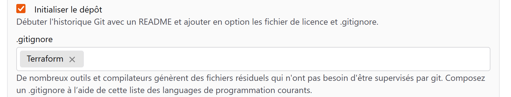

## **Introduction**

### Objectif

L’objectif de cet article est de présenter Forgejo tout en illustrant la mise en place d’un pipeline CI/CD permettant d’automatiser le déploiement d’infrastructure avec OpenTofu.

### Prérequis

  - Un serveur Incus fonctionnel.

-----

## **Forgejo**

### Présentation


Forgejo propose une alternative **open‑source** à GitHub, offrant une interface comparable tout en restant très légère grâce à son implémentation en **Go**. La maintenance se résume généralement à la modification du fichier de configuration `app.ini`.

**Pourquoi choisir Forgejo ?**

Considérez les critères suivants :

  - Besoin d’une solution **open‑source** ?  
  - Souhait d’une plateforme **facile à maintenir** ?  
  - Importance accordée à une communauté active ?  
  - Nécessité d’un environnement **CI/CD** intégré.

Si ces points correspondent à vos exigences, Forgejo constitue une option pertinente.

### L'architecture de Forgejo

Forgejo repose sur deux composants majeurs :

1. **Serveur Forgejo** – Stocke les dépôts Git et orchestre les automatisations.
2. **Runners** – Exécutent les tâches de **build**, **test** ou **deployment** qui leur sont assignées.

### Forgejo Actions

Forgejo Actions fournit la couche CI/CD. Les concepts clés sont :

- **Workflows** – Fichiers `.yml` décrivant une séquence de **jobs** déclenchés par un **event** (push, pull‑request, etc.).
- **Jobs** – Ensemble d’étapes (**steps**) exécutées sur le même **executor**.
- **Events** – Actions du dépôt qui déclenchent les workflows. La liste complète des événements est disponible [ici](https://forgejo.org/docs/latest/user/actions/reference/#jobsjob_idif).

-----

## **Installation et Configuration**

### Création d’une instance Forgejo

```bash
incus launch images:debian/12 forgejo
```

Dans l’instance, j’installe les paquets requis :

- `openssh-server`
- `gpg`
- `wget`

```bash
incus exec forgejo -- apt install openssh-server gpg wget
```

### Installation de Forgejo

L'installation de Forgejo est très bien guidée. Vous pouvez suivre la [documentation officielle](https://forgejo.org/docs/latest/admin/installation/binary/).

Pour ma part, je l'ai déployé avec une **database SQLite** directement intégrée. Sachez que Forgejo supporte également d'autres **databases**, comme :

  - MySQL
  - PostgreSQL
  - MariaDB

Vous trouverez les instructions pour la préparation de ces **databases** [ici](https://forgejo.org/docs/latest/admin/installation/database-preparation/).

Les opérations ci-dessus sont à réaliser dans l'instance Forgejo. Pour accéder au **shell** de l'instance, nous devons utiliser la commande suivante :

```
incus shell forgejo
```

### Exposer Forgejo avec Incus

Pour exposer Forgejo, j'ai ajouté des **devices** de type `proxy` qui vont transférer les requêtes du port de mon hôte vers Forgejo.

Pour la redirection HTTP :

```bash
incus config device add forgejo http-proxy proxy listen=tcp:<Ip de l'hôte Incus>:3000 connect=tcp:<Ip de l'instance forgejo>:3000
```

Pour la redirection SSH :

```bash
incus config device add forgejo ssh-proxy proxy listen=tcp:<Ip de l'hôte Incus>:222 connect=tcp:<Ip de l'instance forgejo>:22
```

### Première connexion

Une fois toutes les étapes d’installation terminées, l’accès à l’interface de Forgejo se fait via l’URL suivante : `http://<IP_de_votre_hôte>:3000`.

Lors de la première connexion, Forgejo vous demande de préciser des paramètres tels que le port SSH ou le port HTTP.

>Il est possible de modifier à tout moment les paramètres de Forgejo dans le fichier `/etc/forgejo/app.ini`.

L’option Disable `self‑registration` permet de restreindre la création de comptes à l’administrateur. Cette option n’est valable que si un compte administrateur a déjà été créé. La création du compte administrateur s’effectue dans la section `Administrator account settings` de la page d’administration.


### Configuration SSH

Pour ajouter une clé SSH à Forgejo, il suffit de cliquer sur le profil de l’utilisateur actuel, puis de se rendre dans `Settings > SSH/GPG Keys > Manage SSH Keys`.

Pour la configuration de SSH, je vous recommande de lire la  [page suivante](https://docs.codeberg.org/security/ssh-key/) qui explique bien mieux que moi comment utiliser les clés SSH.


-----

## **Mise en place du workflow**

### Création du dépôt

La première étape consiste à créer le **repository** dans lequel nous allons stocker nos fichiers :

- `main.tf`
- `variables.tf`
- `provider.tf`

> OpenTofu stocke son état dans le fichier `terraform.tfstate`. Pour éviter que ce fichier ne soit versionné dans le **repository**, il faut créer un fichier `.gitignore` qui exclut les fichiers d’état.

Pour ce faire, cochez l’option **« Initialiser le dépôt »** et choisissez le modèle `.gitignore` pré‑défini pour Terraform.



### Les Runners

#### Création de l’instance OpenTofu

Je crée ici une instance qui sera chargée d’exécuter mon code OpenTofu.

```bash
# Lancement de l’instance 
incus launch images:debian/12 opentofu 

# Installation des dépendances nécessaires 
incus exec opentofu -- apt install gpg curl wget jq nodejs
```

> J’ai besoin de **Node.js** ici, car mon **workflow** fait appel à des **actions** qui en dépendent. Le reste des paquets sert à l’installation du **runner**.

Ensuite, j’installe OpenTofu comme indiqué dans la [documentation officielle](https://opentofu.org/docs/intro/install/deb/).

#### Installation et configuration du Runner

Une fois l’instance créée, il faut installer le **runner**. La procédure est décrite dans la [documentation officielle](https://forgejo.org/docs/latest/admin/actions/runner-installation/#binary-installation) . Dans cet exemple, le **runner** a été installé via le **binaire** plutôt qu’avec l’**image OCI**.

Ensuite, le **runner** doit se connecter à Forgejo avec la commande `forgejo-runner register`. Après son exécution, les informations suivantes sont requises :

- **Lien vers l’API de Forgejo** : par exemple, `http://<ip>:3000/`.
- **Token** : disponible dans les paramètres du **repository**, sous `Actions → Runners → Create a new runner`.
- **Nom du runner** : repris par défaut le nom de l’hôte.
- **Labels** : précisent le type d’environnement nécessaire à l’exécution des tâches. Des informations complémentaires sont disponibles sur la [page suivante](https://forgejo.org/docs/latest/admin/actions/#choosing-labels).

Pour que les **actions** s’exécutent directement dans le **shell** de l’instance OpenTofu, un **label** de type `host` est nécessaire.

> Par défaut, si le type de **label** n’est pas indiqué, le **runner** utilise **Docker**. Pour forcer l’utilisation du shell, indiquer explicitement : `<label>:host`.

Une fois le **runner** enregistré, le lancer en tant que **service systemd** (voir les instructions détaillées [ici](https://forgejo.org/docs/latest/admin/actions/runner-installation/#running-as-a-systemd-service)). Dans le fichier `forgejo-runner.service`, la ligne `After=docker.service` peut être supprimée.

Le **runner** doit alors apparaître comme sur la capture d’écran ci‑dessous.


### Les Secrets

Dans les paramètres du **repository**, sous la section `Actions > Secrets`, on déclare des **secrets**.

Les **secrets** permettent de stocker des mots de passe ou des **tokens** destinés à être utilisés dans le **workflow**. Ils sont chiffrés et conservés dans la **base de données**.

Les **secrets** sont enregistrés sous forme de paires **clé‑valeur** et sont invoqués dans le **workflow** de la manière suivante : `${{ secrets.CLE }}`.

Ces **secrets** serviront notamment à stocker le **token** d’accès à Incus.


### Création du workflow

Pour permettre l’exécution des workflows, le paramètre **Actions** doit être activé. Vous le trouverez dans les paramètres du **repository**, sous la section `Fonctionnalités > Vue générale`.


Dans le **repository local**, j’ai créé un fichier `.forgejo/workflows/opentofu.yaml` qui décrit les étapes du **workflow**.

Mon objectif est de lancer ce **workflow** à chaque **push**.

```yaml
on: [push] # Le workflow se lance à chaque "push" sur le repository.

env:
  TF_VAR_incus: ${{secrets.INCUS}} # Déclare une environnement variable contenant le token d'incus.

jobs:
  Deploy: # Crée un job nommé "Deploy".
    runs-on: opentofu # Ce job sera exécuté sur un runner "opentofu".
    steps:
      - name: Checkout repository
        uses: actions/checkout@v4 # Récupère le code source du repository pour le runner.
      
      - name: Init OpenTofu # Initialise le projet OpenTofu.
        run: tofu init
      
      - name: Check OpenTofu files
        run: | # Vérifie la syntaxe des fichiers .tf.
          echo "Vérification des fichiers OpenTofu..."
          tofu validate
          
      - name: Show OpenTofu plan
        run: | # Montre le deployment plan généré par OpenTofu.
          echo "Affichage du plan d'exécution de OpenTofu..."
          tofu plan
          
      - name: Deploy instances
        run: | # Déploie les instances.
          echo "Déploiement des instances..."
          tofu apply -auto-approve
```


-----

## **Conclusion**

Ces premiers pas avec Forgejo montrent déjà que la plateforme constitue une base solide pour mettre en place des pipelines CI/CD. Quelques améliorations restent à envisager :

- **HTTPS** : configurez TLS (certificat auto‑signé ou via ACME) pour assurer l’intégrité et la confidentialité des échanges.
- **Gestion du tfstate** : Forgejo ne propose pas de backend natif pour stocker l’état de Terraform/OpenTofu. Il faut donc déployer une solution dédiée (MinIO, S3 compatible ou autre serveur d’objets) et configurer le backend distant dans vos fichiers.

Malgré ces points, Forgejo se démarque par :

- **Des workflows simples** : les pipelines sont définis dans des fichiers YAML clairs, faciles à lire et à maintenir.
- **Une interface ergonomique** : l’expérience utilisateur est fluide et moins encombrée que sur GitLab ou GitHub, ce qui facilite la prise en main, surtout pour les équipes novices en CI/CD.

En bref, Forgejo est aujourd’hui une solution fiable et accessible pour automatiser la construction, les tests et le déploiement. Son adoption constitue un bon point de départ, tout en laissant la possibilité d’ajouter ultérieurement des outils complémentaires comme Devbox pour enrichir l’environnement de développement.

> 👉 **Pour découvrir d’autres solutions CI/CD et comparer leurs fonctionnalités, consultez le dépôt GitHub :** [https://github.com/ligurio/awesome-ci](https://github.com/ligurio/awesome-ci).


