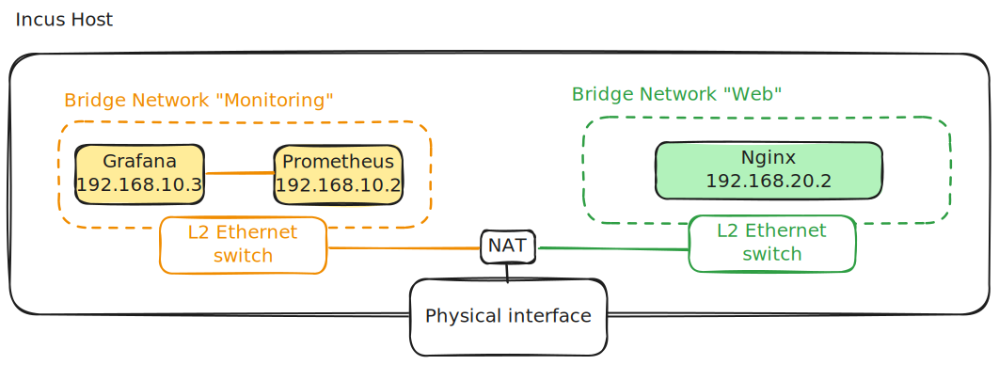

## Introduction à l'IaC avec OpenTofu et Incus

### Introduction

**La problématique**

Dans le lab précédent, je vous ai fait une petite démonstration d'**Incus** et de ses avantages par rapport à **Docker**.

Malheureusement, cela ne veut pas dire qu'Incus peut totalement remplacer **Docker** et, d'ailleurs, il n’est pas conçu pour ça.

**Docker** (tout comme **Kubernetes**) possède un avantage significatif en matière de déploiement. Je peux notamment citer **l’approche déclarative**. Avec Docker, on utilise des fichiers `docker-compose.yml` qui permettent de décrire l’infrastructure souhaitée via un fichier de configuration, plutôt que de passer entièrement par la ligne de commande (approche impérative). Contrairement à Incus qui se manipule principalement de manière impérative.

### Comment faire avec Incus ?

Il est possible de coupler Incus à des outils tiers pour adopter une approche déclarative.

Actuellement, plusieurs options existent sur le marché. On pense notamment à **Terraform**, un outil largement adopté et reconnu par la communauté. Cependant, Terraform n’est plus **open source**.

Aujourd’hui, le logiciel qui nous permet de tirer pleinement parti de la puissance de l’**Infrastructure as Code (IaC)**, tout en restant **open source**, c’est **OpenTofu**.

> **Pour la culture**
>
> **Terraform** était autrefois **open source**, mais en 2023, **HashiCorp** (l’entreprise qui le maintient) a changé sa licence pour la **BSL (Business Source License)**.
>
> Face à cela, la communauté (notamment open source et Linux) a réagi rapidement. Un fork open source de Terraform a vu le jour sous le nom d’**OpenTofu**.
>
> **OpenTofu** est aujourd’hui un projet soutenu par la **Linux Foundation**, et il adopte une licence réellement libre : la **Mozilla Public License (MPL)**.

-----

## Prérequis

  - Un serveur Incus configuré
  - Le client Incus configuré

-----

## Les premières étapes

### Comment fonctionne OpenTofu

Le flux de travail d'OpenTofu peut être décomposé en trois grandes parties :

  - **Write** : Déclaration de l'infrastructure souhaitée
  - **Plan** : Génération d'un plan d'exécution détaillé par OpenTofu
  - **Apply** : Validation et application du plan

OpenTofu gère un système d'état en sauvegardant les informations dans un fichier nommé `terraform.tfstate`.

Ce fichier permet de garder en mémoire la composition de l'infrastructure. Ce suivi permet à **OpenTofu** d'effectuer uniquement les opérations nécessaires demandées par l'utilisateur, en comparant l'état actuel contenu dans le fichier `terraform.tfstate` à l'état désiré par nos fichiers `.tf`.

Pour cet article, je vais construire trois fichiers :

  - `main.tf` : décrit les ressources à déployer
  - `providers.tf` : contient les spécifications permettant à OpenTofu de communiquer avec Incus
  - `variables.tf` : définit les variables

-----

### Installation

Vous pouvez l’installer directement via le gestionnaire de paquets intégré à votre système d’exploitation. Cliquez [ici](https://opentofu.org/docs/intro/install/) pour accéder à la page d’installation.

```bash
# pour fedora
sudo dnf install opentofu
```

### Configuration du provider

Les providers sont des plugins qui permettent à OpenTofu d'interagir avec l'API de la cible. Dans notre cas, nous allons utiliser OpenTofu pour provisionner notre serveur Incus.

Dans votre répertoire de travail, créez un fichier `providers.tf`. Une fois le fichier créé, insérez les lignes suivantes :

```hcl
terraform {
  required_providers {
    incus = {
      source = "lxc/incus"
      version = "0.4.0"
    }
  }
}

provider "incus" {
  # Configuration options
}
```

Si, comme moi, vous avez déjà configuré la connexion distante avec le **client Incus**, vous n'avez pas besoin de spécifier d'options de configuration pour le provider (comme ci-dessus). En revanche, si vous n'avez pas configuré le client Incus, vous pouvez toujours fournir les informations de connexion à OpenTofu en spécifiant les paramètres suivants :

```hcl
provider "incus" {
  generate_client_certificates = true
  accept_remote_certificate    = true

  remote {
    name    = "name of the remote"
    scheme  = "https"
    address = "incus server ip address"
    token   = "token"
  }
}
```

Pour comprendre comment obtenir le token ou configurer les clients Incus, je vous conseille de lire l'article [Découverte de Incus](https://bluecaelo.github.io/posts/decouverte-incus/).

Une fois les fichiers créés, initialisez l'espace de travail et installez les plugins via la commande suivante :

```bash
tofu init
```

-----

## Mise en place de l'infrastructure

### Topologie
Je vais déployer l'infrastructure suivante :




Les opérations qui vont suivre se feront dans les fichiers `main.tf` et `variables.tf`.

Dans le fichier `main.tf`, je vais déclarer les ressources. Une **ressource** est un objet de l'infrastructure. Dans le cas d'Incus, cela peut être :

  - un conteneur LXC
  - une VM
  - un réseau
  - un profil
  - etc.

-----

### Création des réseaux

Mes réseaux **Bridge** ont globalement la même configuration. La seule différence réside dans leur sous-réseau respectif. Je peux donc utiliser une **boucle** pour automatiser leur création.

Dans le fichier `variables.tf`, je vais déclarer les **attributs de chaque réseau**, afin d'éviter de surcharger le fichier `main.tf`.

```hcl
variable "network_list" {
  default = {
    "monitoring_network" = {
      name        = "monitoring"
      ipv4Address = "192.168.10.1/24"
      ipv6Address = "none"
      ipv4Nat     = "true"
    }

    "web_network" = {
      name        = "web"
      ipv4Address = "192.168.20.1/24"
      ipv6Address = "none"
      ipv4Nat     = "true"
    }
  }
}
```

Ici, je déclare une structure imbriquée. Dans cette structure, j'enregistre les paramètres de mes réseaux. C'est extrêmement pratique, car cela me permet d'alléger la lecture du fichier `main.tf` et de faire des modifications rapides.

```hcl
# Dans le fichier main.tf
# Création des réseaux Bridges
resource "incus_network" "networks" {
  for_each = var.network_list
  name     = each.value.name
  type     = "ovn"

  config = {
    "ipv4.address" = each.value.ipv4Address
    "ipv4.nat"     = each.value.ipv4Nat
    "ipv6.address" = each.value.ipv6Address
  }
}
```

Ici, je parcours ma structure avec un `for_each` afin de créer mes réseaux. Cela rend le fichier extensible, car je peux simplement ajouter des entrées à ma structure `network_list` et j'aurai le nombre de réseaux que je désire.

-----

### Création des instances

Pour créer nos instances, nous allons opérer de la même manière que pour la création de réseaux. Je vais donc, dans un premier temps, créer une structure dans le fichier `variables.tf` afin de fournir les informations utiles à la création de mes instances.

```hcl
variable "instance_list" {
  default = {
    "prometheus" = {
      name        = "prometheus"
      ipv4Address = "192.168.10.2"
      network     = "monitoring"
      image       = "images:debian/12"
    }
    "grafana" = {
      name        = "grafana"
      ipv4Address = "192.168.10.3"
      network     = "monitoring"
      image       = "images:debian/12"
    }

    "nginx" = {
      name        = "nginx"
      ipv4Address = "192.168.20.2"
      network     = "web"
      image       = "images:debian/12"
    }
  }
}
```

Puis, dans le fichier `main.tf`, je vais donner les spécifications des ressources et indiquer à OpenTofu qu'il doit parcourir la structure `instance_list` pour créer les instances.

```hcl
resource "incus_instance" "monitoring" {
  for_each = var.instance_list
  name     = each.value.name
  image    = each.value.image
  device {
    name = "eth0"
    type = "nic"
    properties = {
      "network"      = each.value.network
      "ipv4.address" = each.value.ipv4Address
    }
  }
}
```

> Le paramètre `device` contient la configuration de la carte réseau de mon instance.

### Déploiement

Pour déployer l'infrastructure, il faut exécuter la commande :

```bash
tofu apply
```

La commande `tofu apply` affiche le plan d'exécution par défaut avant de demander une confirmation. Il n'est donc pas strictement nécessaire d'exécuter `tofu plan` au préalable. Si vous voulez uniquement consulter les changements, exécutez la commande `tofu plan`.

-----

## Conclusion

**OpenTofu** est un outil puissant qui transforme la gestion de votre infrastructure. Grâce à son approche déclarative, il offre un gain de temps considérable et une grande flexibilité en rendant le déploiement et les modifications de votre infrastructure reproductibles et faciles à gérer.

Je n'ai fait qu'effleurer les possibilités offertes par le provider Incus et OpenTofu en général. Pour explorer toutes les fonctionnalités, je vous encourage vivement à consulter la documentation officielle d'OpenTofu. Il est également compatible avec de nombreux autres environnements, comme Proxmox ou AWS. Pour découvrir la liste complète des providers, cliquez [ici](https://registry.terraform.io/).

-----

## Sources

  - [OpenTofu Docs](https://opentofu.org/docs/intro/install/)
  - [Incus Docs](https://linuxcontainers.org/incus/docs/main/)